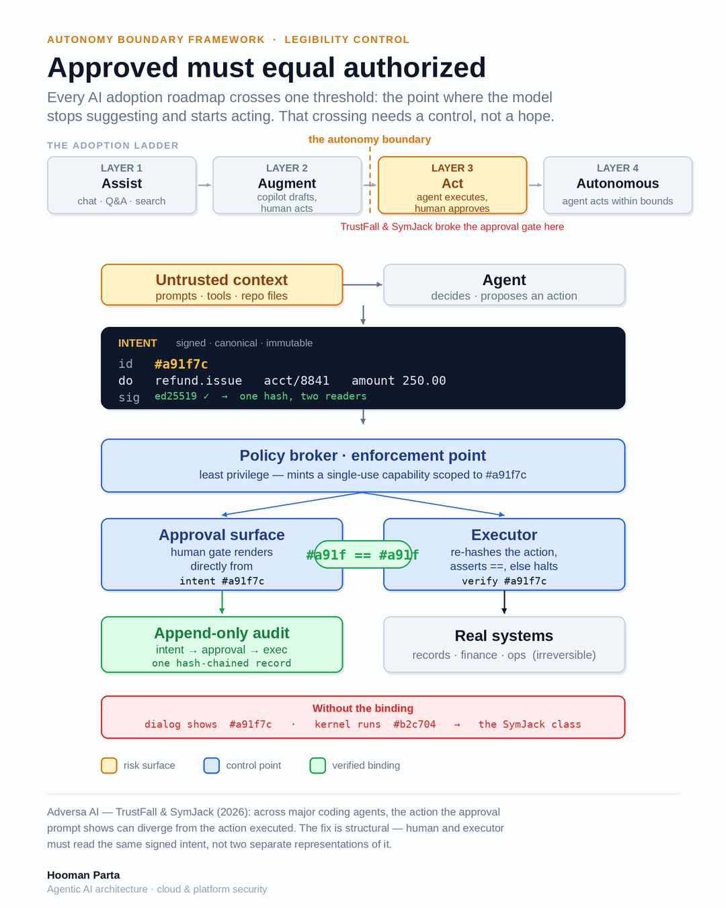

# The Autonomy Boundary Framework

**Eight controls for auditable agent autonomy.**

The line where a system stops assisting and starts acting — and the proof that it stayed inside it.

> Approved must equal authorized. The world behind that approval must still deserve to govern.

A wrong model answer is an edit. A wrong **action** is an incident, a breach notice, or a finding. The TrustFall and SymJack disclosures showed the failure across major coding agents: the action a human approves on screen and the action the runtime is empowered to take can diverge. The user approves "trust this folder." The system hears "run arbitrary code." The dialog looked normal.

A second failure is quieter. Every control can pass and the action can still be wrong, because the state that made it eligible has gone stale. This framework is the runtime control plane that makes agent autonomy **provable** — to an examiner, an auditor, a clinician, a court, or an incident review.

**Status:** v0.3 reference implementation (Python 3.10+). The `demo/` scripts run on Python 3.9+ with no dependencies.



## Run the demos

**Legibility — approved must equal authorized:**

```bash
python3 demo/intent_binding.py            # hashes match → executes
python3 demo/intent_binding.py --attack   # runtime swaps the action → fails closed
python3 demo/intent_binding.py --resolve  # execution-time path resolution diverges → fails closed
```

**State Admissibility — the world behind the approval still governs:**

```bash
python3 demo/state_admissibility.py           # bound state still current → executes
python3 demo/state_admissibility.py --stale   # account frozen after approval → fails closed
```

**Provability — the tamper-evident ledger:**

```bash
python3 demo/ledger.py            # append decisions, verify the chain
python3 demo/ledger.py --tamper   # edit a past entry → chain breaks, visibly
```

The approval binds to a canonical hash of the post-resolution effect. The enforcement point re-checks that hash at execution, re-hashes decision-critical state before effect, and appends every decision to a chain where tampering is mathematically visible.

## The eight controls

Organized by when they apply in an action's life.

**Before the agent acts**

| Control | Question it answers |
|---|---|
| **Scope** | What is it allowed to touch at all? Checked against the resolved target, not the display path. |
| **Authority** | What may it do within that scope? Signed, allowlisted, inside a capability envelope, under a cumulative chain budget. Borrowed power, not a standing key. |
| **Input Integrity** | Can the thing it is acting on be trusted? Poisoned files, hostile repos, and injected instructions are caught before they become an action. |

**At the boundary — the moment of crossing**

| Control | Question it answers |
|---|---|
| **Reversibility** | Can this be undone? If not, it waits for a human. Irreversible actions are a different class. |
| **Legibility** | Is what the human approved provably identical to the post-resolution effect about to run? Checked at the last enforcement point after resolution; fails closed on mismatch. |
| **State Admissibility** | Does the world that made this action eligible still deserve to govern? Policy-declared dependencies are re-hashed; high-risk actions require both a live window and a matching snapshot. |

**After, and continuously**

| Control | Question it answers |
|---|---|
| **Observability** | Can you see what it did — what it saw, what it chose, and why? |
| **Provability** | Can you prove that record was not altered afterward? Hash-chained, append-only, and it binds what was approved, what was in force, and which instance acted — held outside both the agent and the enforcement point. |

Observability and Provability are separate controls with separate custodians. A check at the moment of action only counts if it produces a record, and the record only counts if three facts are bound together: what was approved, what was actually in force, and which instance of the agent acted. The enforcement point must *produce* that evidence — it is the only component that sees the full binding — but must not *hold* it. Otherwise the proof is a report written by the thing under investigation.

## Reference implementation

The `demo/` scripts are standalone. The full framework — all eight controls, wired into a lifecycle orchestrator that runs them in order and halts on any denial or exception — lives under `src/abf/`.

```bash
pip install -e ".[dev]"
pytest -q                              # test suite
python examples/refund_agent.py        # end-to-end: swap, stale state, chain budget
python evals/owasp_asi_coverage.py     # adversarial scenarios → control matrix
```

The refund example approves a $250 refund, executes it, then attempts a $25,000 intent against the same approval token. Legibility denies it: the approved hash and the executing hash differ. It then freezes the account under the same approval. State Admissibility denies it.

Optional SDK harnesses (LangChain, Anthropic, OpenAI, Gemini, OpenRouter Python, and a small TypeScript Agent SDK demo) wrap the same PEP. They are not a ninth control: memory, KV, and prompt-cache sessions are effects the eight already govern. Fake-model by default; `--live` needs extras and API keys. See [`examples/harnesses/README.md`](examples/harnesses/README.md).

```bash
pip install -e ".[harness]"          # optional; not required for pytest
python examples/harnesses/openrouter_refund.py
```

- Each control is a module under `src/abf/controls/`.
- The orchestrator (`src/abf/boundary.py`) runs them in lifecycle order.
- `Intent` (`src/abf/intent.py`) serializes canonically so its hash is stable across the approval surface and the executor. The hash binds the post-resolution effect and the state snapshot. The reference uses HMAC-SHA256 to keep dependencies minimal; production should use Ed25519. The binding logic is identical.

## Scope of this framework

This framework governs the **runtime boundary**: what an agent does when it acts, and whether you can prove it. It does not address model alignment, training-data governance, or full supply-chain assurance. Those are a different control surface.

Existing frameworks (OWASP Top 10 for Agentic Applications, NIST's AI agent work, CSA MAESTRO, ISO 42001, vendor security stacks) enumerate threats and cover *authorization*. What they do not isolate as a first-class control is **consent integrity** — the guarantee that what a human approved is provably what the agent was authorized to do. That is Legibility. State Admissibility is the sibling: the world behind that consent still has to deserve to govern.

### Accepted from public review

- [#1 State Admissibility](https://github.com/hoomanp/autonomy-boundary/issues/1) — James Mayo / Sheila Studios. Now control #8.
- [#2 Semantic binding](https://github.com/hoomanp/autonomy-boundary/issues/2) — Girimaji S. Bound into Legibility and Authority.
- [#3 Proof custody](https://github.com/hoomanp/autonomy-boundary/issues/3) — Vinay Bansal / UBIQS. Bound into Provability: the moment-of-action record binds approved × in-force grant × instance identity, held outside the agent.

### Remaining limits

1. **Original-state soundness** — a matching state hash proves the snapshot is unchanged, not that it was sound when taken.
2. **Resolution coverage** — environment expansion, aliases, POSIX normalize, and symlink follow are in. Network-layer redirects and container path mapping are not.
3. **Instance identity and ledger custody** — the reference records instance identity as a signed software claim and still co-locates the ledger with the enforcement point. Hardware attestation and a ledger in a different trust domain are the production bar.

Field reports from regulated deployments are welcome. Open an issue.

## Documents

- [`docs/framework.md`](docs/framework.md) — lifecycle phasing, each control in depth, and what ABF excludes.
- [`docs/THREAT_MODEL.md`](docs/THREAT_MODEL.md) — adversaries, control mapping, trust assumptions, and explicit non-goals.
- `demo/` — runnable controls, no dependencies.
- `src/abf/` — reference implementation.
- [`examples/harnesses/`](examples/harnesses/) — optional SDK wrappers; ABF remains the PEP.

## Author

**Hooman Parta** — [linkedin.com/in/hooman-parta](https://www.linkedin.com/in/hooman-parta)

25+ years securing cloud platforms at Fortune-100 scale. Companion essays: *The Autonomy Boundary* series and *The Last Mile* (finance, healthcare, retail, and government), on LinkedIn.

## License

MIT — see [`LICENSE`](LICENSE).
