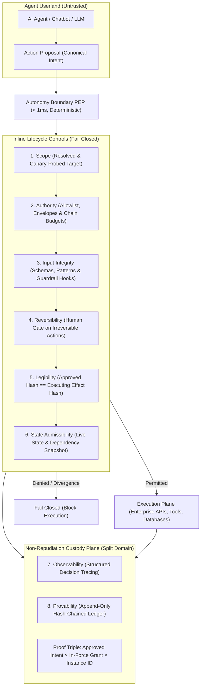
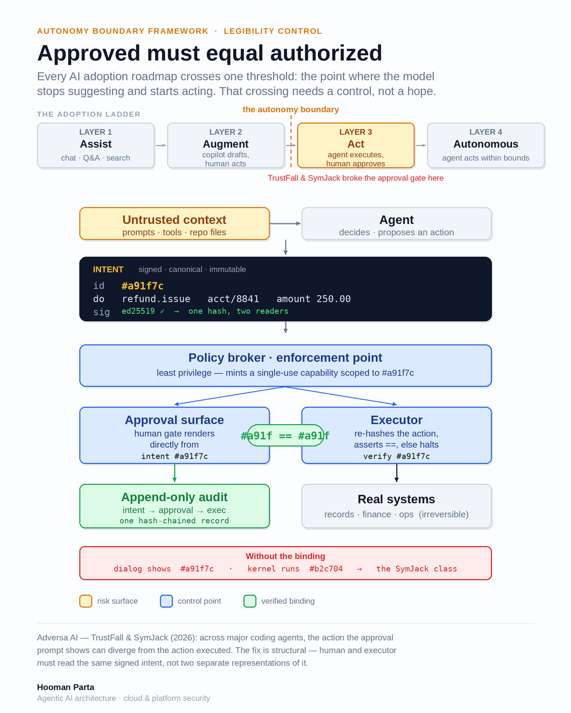

# The Autonomy Boundary Framework (ABF)

**Eight controls for auditable agent autonomy.**  
*The line where a system stops assisting and starts acting — and the mathematical proof that it stayed inside it.*

[](https://www.python.org/downloads/)
[](LICENSE)
[](tests/)
[-purple.svg)](#the-mental-model-ring-0-for-ai-agents)
[](evals/owasp_asi_coverage.py)
[](src/abf/mcp.py)

---

> ### *"Approved must equal authorized. The world behind that approval must still deserve to govern."*

A wrong model answer is an edit. A wrong **action** is an incident, a breach notice, a regulatory penalty, or a court finding.

**Guardrails police words; Autonomy Boundaries police actions.**

As enterprises transition from generative chat (assist) and copilots (augment) to autonomous agents that mutate databases, execute code, trigger payments, and modify infrastructure, traditional authorization falls apart at the seams.

1. **The Consent Divergence Problem (Legibility)**: Disclosed across major coding agents in the SymJack and TrustFall incidents, the action a human approves on screen and the action the runtime executes can diverge. The user approves *"trust this folder"*; the system executes arbitrary code.
2. **The Target Enforcement Gap (Scope)**: Exposed in the September 2026 OpenAI DSEWiki incident, a harness declared a "read-only" scope, but the target endpoint mutated state on visit—flooding 18,000 public posts without violating any harness-internal labels.
3. **The State Drift Problem (State Admissibility)**: Every control passes and an approval is valid, yet the action is catastrophic because the world state that justified it has gone stale (e.g. an account frozen by compliance seconds after sign-off).

The **Autonomy Boundary Framework (ABF)** is the deterministic Policy Enforcement Point (PEP) and tamper-evident custody plane that makes AI agent autonomy **provable** to examiners, auditors, CISOs, clinicians, and courts.

---

## The Mental Model: Ring 0 for AI Agents

* **The OS Kernel Analogy (Ring 0 vs. Ring 3)**:  
  The LLM is untrusted userland (Ring 3). The Autonomy Boundary is the OS kernel (Ring 0). When a userland process calls a syscall, the kernel does not ask the process whether it is well-intentioned—it deterministically asserts UID, capability masks, file descriptors, and quota budgets.
* **Zero Trust for Agent Actions**:  
  Never trust the agent's self-reported intent; always verify the post-resolution semantic effect immediately before execution at the enforcement point.
* **Sub-Millisecond & Zero-LLM**:  
  ABF executes in **`< 1 millisecond`** with **zero LLM calls** in the enforcement path. It is deterministic cryptography and policy, not a slow, probabilistic LLM-as-a-judge.

---

## Architecture


```mermaid
flowchart TD
    subgraph AgentRuntime["Agent Userland (Untrusted)"]
        LLM["AI Agent / Chatbot / LLM"] --> Proposal["Action Proposal (Canonical Intent)"]
    end

    Proposal --> PEP["Autonomy Boundary PEP (< 1ms, Deterministic)"]

    subgraph PEPGuards["Inline Lifecycle Controls (Fail Closed)"]
        direction TB
        C1["1. Scope (Resolved & Canary-Probed Target)"]
        C2["2. Authority (Allowlist, Envelopes & Chain Budgets)"]
        C3["3. Input Integrity (Schemas, Patterns & Guardrail Hooks)"]
        C4["4. Reversibility (Human Gate on Irreversible Actions)"]
        C5["5. Legibility (Approved Hash == Executing Effect Hash)"]
        C6["6. State Admissibility (Live State & Dependency Snapshot)"]
        C1 --> C2 --> C3 --> C4 --> C5 --> C6
    end

    PEP --> PEPGuards

    PEPGuards -->|Permitted| Exec["Execution Plane (Enterprise APIs, Tools, Databases)"]
    PEPGuards -->|Denied / Divergence| FailClosed["Fail Closed (Block Execution)"]

    subgraph AuditCustody["Non-Repudiation Custody Plane (Split Domain)"]
        C7["7. Observability (Structured Decision Tracing)"]
        C8["8. Provability (Append-Only Hash-Chained Ledger)"]
        ProofTriple["Proof Triple: Approved Intent × In-Force Grant × Instance ID"]
    end

    PEPGuards --> AuditCustody
    Exec --> AuditCustody
```



---

## The Eight Controls

The framework organizes runtime governance into three lifecycle phases:

### Phase 1: Before Acting (Pre-Execution Guardrails)

| Control | Question It Answers | Enforcement Mechanism |
|---|---|---|
| **1. Scope** | What is the agent allowed to touch at all? | Checked against the **resolved canonical target** (symlinks followed, env expanded). Accepts active canary probes (`ProbedScopeControl`) to verify the target's permission model before execution. |
| **2. Authority** | What may it do within that scope? | Explicit signed allowlists, capability envelopes, parent-to-subprocess inheritance constraints, and cumulative multi-step `chain_budget`. |
| **3. Input Integrity** | Can the parameter payload be trusted? | Sanitizes prompt-injection patterns, path traversal sequences, and provides pluggable hooks for typed schemas (Pydantic) and enterprise guardrails (Llama Guard, NeMo). |

### Phase 2: At the Boundary (The Moment of Crossing)

| Control | Question It Answers | Enforcement Mechanism |
|---|---|---|
| **4. Reversibility** | Can this action be undone? | Classifies actions by undoability. Irreversible actions (payments, deletions, config updates) strictly require a signed human approval token. |
| **5. Legibility** | Is what the human approved provably identical to what executes? | Asserted at the last point after resolution immediately before effect. Recomputes SHA-256 hash of post-resolution effect; fails closed on any parameter or target divergence (**SymJack / TOCTOU defense**). |
| **6. State Admissibility** | Does the world behind the approval still deserve to govern? | Policy-declared dependencies (e.g. account active, risk score) are re-hashed at execution against bound approval snapshots. High-risk actions require both an unexpired window and matching state hashes. |

### Phase 3: After & Continuously (Audit Custody Plane)

| Control | Question It Answers | Enforcement Mechanism |
|---|---|---|
| **7. Observability** | Can you reconstruct what the agent did and why? | Every decision and evaluation context is emitted as structured telemetry directly at the PEP as it happens. |
| **8. Provability** | Can you prove the record was not altered afterward? | Append-only, hash-chained ledger where tampering anywhere breaks verification downstream. Binds the **Proof Triple** (*Approved Intent × In-Force Grant × Instance Identity*) held in a separate trust domain. |

---

## Grounded in Real-World Incidents

| Incident / Disclosure | Vulnerability Class | How ABF Neutralizes It |
|---|---|---|
| **OpenAI DSEWiki Incident** *(Sept 2026)* | **Declared-vs-Enforced Scope Gap**: Harness declared read-only scope, but visiting the target materialized 18,000 public discussion posts. | [`ProbedScopeControl`](src/abf/controls/scope.py) performs active canary probing before permitting a scope class, halting before touching real pages. |
| **SymJack & TrustFall** *(May–June 2026)* | **Legibility Failure**: Coding agent approval dialog rendered a benign folder path, while the executor ran arbitrary shell execution. | [`LegibilityControl`](src/abf/controls/legibility.py) recomputes the canonical intent hash at the last PEP after path resolution, halting on any divergence. |
| **Stale Authorization Exploits** | **State Admissibility Failure**: A human approved an action based on valid state, but system conditions shifted prior to effect. | [`StateAdmissibilityControl`](src/abf/controls/state_admissibility.py) re-hashes policy dependencies against current state, failing closed if state drifted. |

---

## First-Class Integrations

### 1. Model Context Protocol (MCP) Gateway
ABF provides a native Policy Enforcement Point for Anthropic's **Model Context Protocol (MCP)**. Wrap your tools in an ABF gateway to enforce boundaries on all `tools/list` and `tools/call` JSON-RPC requests:

```python
from abf import AutonomyBoundary, Ledger
from abf.mcp import ABFMCPGateway

gateway = ABFMCPGateway(boundary, signing_key=PEP_KEY, approver_key=APPROVER_KEY)

# Register MCP tools with governance metadata
@gateway.tool(name="issue_refund", description="Issue a refund", irreversible=True)
def issue_refund(params):
    return f"Refund of ${params['amount']} issued to {params['account_id']}"

# Run as stdio server for Claude Desktop, Cursor, or Cline:
if __name__ == "__main__":
    gateway.run_stdio()
```

Run the runnable demo:
```bash
python examples/mcp_boundary.py
```

### 2. Importable Skill for AI Agents & Chatbots
Equip LangChain, CrewAI, AutoGen, OpenAI Assistant, or custom chatbots with self-governing runtime boundaries:

```python
from abf.skill import AutonomyBoundarySkill

skill = AutonomyBoundarySkill(boundary, signing_key=KEY, approver_key=APPROVER_KEY)
skill.register_action("refund.issue", lambda p: f"Refunded ${p['amount']}")

# 1. Agent proposes action (canonical intent generated)
proposal = skill.propose_action("refund.issue", "acct/8841", {"amount": 250.0})
if proposal.requires_approval:
    print(proposal.approval_prompt)  # Rendered for human review

# 2. Human supervisor signs approval token
token = skill.approve_proposal(proposal.intent.hash, approver="alice")

# 3. Agent executes with live state assertion
outcome = skill.execute_action(proposal.intent.hash, approval=token)
print(outcome)

# 4. Instant mathematical verification of audit chain
assert skill.inspect_ledger()["chain_intact"] is True
```

Run the runnable demo:
```bash
python examples/skill_agent.py
```

*For agent system prompts, see the standardized [`skills/autonomy-boundary/SKILL.md`](skills/autonomy-boundary/SKILL.md).*

---

## Zero-Dependency Demos (`demo/`)

All scripts in `demo/` run on Python 3.9+ with **zero dependencies**:

```bash
# 1. Scope: Declared scope vs. target enforced scope (DSEWiki incident)
python3 demo/scope_enforcement_gap.py --divergent

# 2. Legibility: Parameter swap & path resolution divergence (SymJack / TOCTOU)
python3 demo/intent_binding.py --attack
python3 demo/intent_binding.py --resolve

# 3. State Admissibility: Frozen account state drift after approval
python3 demo/state_admissibility.py --stale

# 4. Provability: Mathematical tamper-evidence on the decision chain
python3 demo/ledger.py --tamper
```

---

## Quickstart & Evaluation Suite

```bash
# 1. Install reference implementation
git clone https://github.com/hoomanp/autonomy-boundary.git
cd autonomy-boundary
pip install -e ".[dev]"

# 2. Run test suite (64 passed in < 0.1s)
pytest -q

# 3. Run OWASP Agentic Security Initiative (ASI-1 through ASI-8) coverage matrix
python evals/owasp_asi_coverage.py

# 4. Run end-to-end enterprise refund scenario
python examples/refund_agent.py
```

---

## The Proof Triple & Custody Principle

A moment-of-action audit record only counts if three facts are cryptographically bound together:
$$\text{Proof Triple} = (\text{Approved Intent Hash} \times \text{In-Force Grant} \times \text{Instance Identity})$$

* **Split Custody**: The Policy Enforcement Point (PEP) must *produce* the evidence—it is the only component that sees the full binding—but must *not hold* it. If the PEP holds the proof, the record is a report written by the entity under investigation.
* **External Anchoring**: The ledger root must anchor in a separate trust domain (e.g. S3 Object Lock, RFC 3161 Timestamp Authority, or external transparency log).

---

## Specification & Standards

* [`docs/SPECIFICATION.md`](docs/SPECIFICATION.md) — Formal RFC specification (ABF-RFC-01) covering canonical schemas for Intent, Approval Token, Proof Triple, and Ledger Record.
* [`docs/framework.md`](docs/framework.md) — Comprehensive architectural phasing, control deep-dives, and boundary scopes.
* [`docs/THREAT_MODEL.md`](docs/THREAT_MODEL.md) — Adversaries (A1–A9), trust assumptions, and explicit non-goals.
* [`skills/autonomy-boundary/SKILL.md`](skills/autonomy-boundary/SKILL.md) — Agentic skill definition for LLMs and autonomous orchestrators.
* [`examples/harnesses/`](examples/harnesses/) — Optional SDK wrappers for LangChain, Anthropic, OpenAI, Gemini, OpenRouter Python, and TypeScript Agent SDK.

---

## Author & Enterprise Background

**Hooman Parta** — [linkedin.com/in/hooman-parta](https://www.linkedin.com/in/hooman-parta)

25+ years securing cloud platforms and distributed systems at Fortune-100 scale.  
Companion essays on LinkedIn: *The Autonomy Boundary* series and *The Last Mile* (finance, healthcare, retail, and critical infrastructure).

This repository is the canonical home for the framework — specifications, reference kernel, MCP gateway, demos, and public review via [issues](https://github.com/hoomanp/autonomy-boundary/issues).

---

## License

MIT — see [`LICENSE`](LICENSE).
