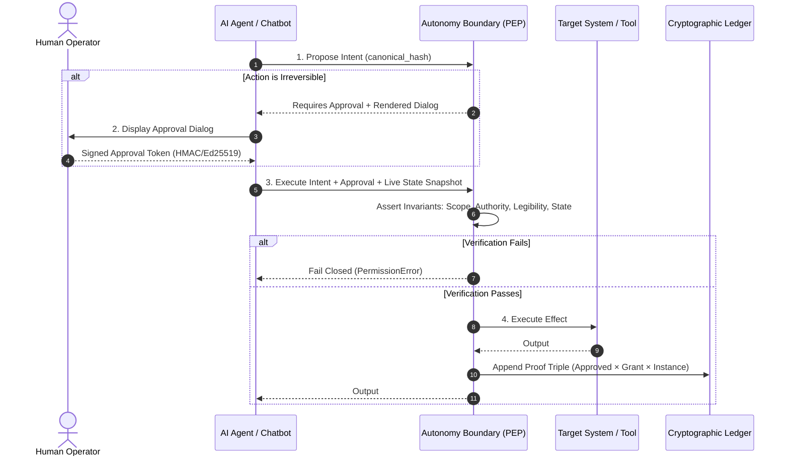

# Autonomy Boundary Skill (ABF)

An operational protocol and skill definition for AI agents, chatbots, and autonomous orchestrators (Claude Code, Cursor, Copilot, LangChain, AutoGen, CrewAI).

> **Core Maxim:** *Approved must equal authorized. The world behind that approval must still deserve to govern.*

---

## When to Activate This Skill

Activate this skill whenever:
1. The agent is about to execute a tool or API call that **mutates state** (writes files, executes shell commands, transfers funds, deletes records, alters cloud infrastructure).
2. The agent operates in an enterprise environment requiring auditable compliance (SOC 2, ISO 42001, HIPAA, FINRA, EU AI Act).
3. The human supervisor requires cryptographic proof that the executed action is bit-for-bit identical to the action approved on screen (**Legibility**).
4. The action depends on decision-critical conditions (e.g. account active, budget remaining, risk scores) that might change between approval and execution (**State Admissibility**).

---

## The 4-Step Protocol for Agents



### Step 1: Propose Intent
Before performing any tool call, construct a canonical `Intent`:
```python
from abf import Intent

intent = Intent(
    action="refund.issue",
    resource="acct/8841",
    params={"amount": 250.00},
    resolved_target="acct/8841",
    effective_identity="agent:assistant",
    capabilities=("refund",),
    data_boundary="acct/8841",
    expiry="2099-01-01T00:00:00+00:00",
    state_deps={"account_status": "4daa3ed4..."},
    validity_window="2099-01-01T00:00:00+00:00",
).sign(SIGNING_KEY)
```

### Step 2: Render Legibility & Request Human Approval
For irreversible actions, never execute silently. Render the human-readable legibility string derived **directly** from the canonical intent:
```python
from abf.controls.legibility import render_for_human, approve

dialog_text = render_for_human(intent)
# Output shown to human:
# "[054633aa344a] refund.issue on acct/8841 as agent:assistant caps=refund data=acct/8841 until 2099-01-01T00:00:00+00:00 with {'amount': 250.0} (hash 4426a086f7a7)"
```
Once approved by the operator, generate the signed approval token:
```python
approval_token = approve(intent, approver="human:alice", key=APPROVER_KEY)
```

### Step 3: Assert Live State Admissibility
Re-sample current system state immediately before executing. If decision-critical conditions have drifted (e.g. account frozen, risk threshold exceeded), the boundary halts:
```python
current_state = snapshot_state({"account_status": live_account.status})
```

### Step 4: Execute through the Boundary
Submit the intent, approval token, and live state to `AutonomyBoundary.execute()`. The boundary verifies all 8 controls in `< 1ms` with zero LLM overhead, writes the decision to the tamper-evident ledger, and returns the result.

---

## Python Integration Example

```python
from abf.skill import AutonomyBoundarySkill

skill = AutonomyBoundarySkill(boundary, signing_key=KEY, approver_key=APPROVER_KEY)
skill.register_action("refund.issue", lambda params: f"Refunded ${params['amount']}")

# 1. Propose
proposal = skill.propose_action("refund.issue", "acct/8841", {"amount": 250.00})
if proposal.requires_approval:
    print(proposal.approval_prompt)

# 2. Approve
token = skill.approve_proposal(proposal.intent.hash, approver="alice")

# 3. Execute
result = skill.execute_action(proposal.intent.hash, approval=token)
print(result)

# 4. Audit
audit = skill.inspect_ledger()
assert audit["chain_intact"] is True
```

---

## Fail-Closed Rules for Chatbots & Agents

1. **Never Bypass Denials**: If the boundary raises `PermissionError`, explain the exact control and reason to the user. Do not retry with modified labels without user awareness.
2. **Never Swap Parameters**: What the user saw on screen cannot be mutated under the hood (Legibility failure).
3. **No Unsigned Tokens**: In production, approval tokens must carry a cryptographic signature.
